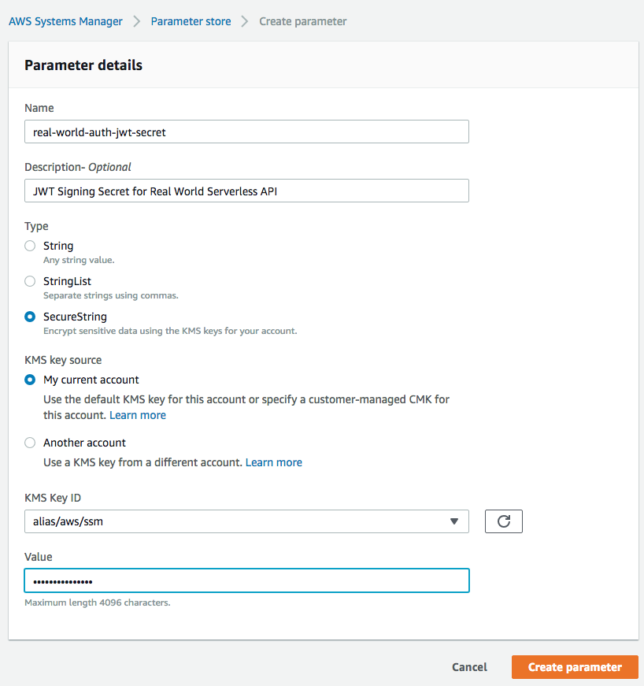

# 

> Example Serverless+Typescript codebase that adheres to the [RealWorld](https://github.com/gothinkster/realworld-example-apps) API spec and opinionated patterns of the [aws-ts-starter](https://github.com/bakerstreet-industries/aws-ts-starter).

# How it works

`aws-realworld-starter` is a [serverless](https://serverless.com/) seed written in Typescript that provides the following out of the box:

* Follows [The Repository Pattern](https://msdn.microsoft.com/en-us/library/ff649690.aspx)
* Structured and intended to be used as a microservice
* 100% unit test coverage of all boilerplate module code to encourage BDD/TDD
* Fully functional end-to-end testing of the RealWorld API spec via a Serverless YAML
* A default Repository implementation against a Dynamo DB
* An AWS handler wrapper that takes care of the API Gateway callback and error handling, either by thrown errors or by caught promises

# Getting started

1. Fork / Clone this repository
2. `npm install`
3. Replace `module` and `Module` with the name of your api
    * e.g. `ModuleService` => `PetService`; `ModuleRepo` => `PetRepo`
4. Install the AWS CLI - `npm install -g aws`
5. Install the Serverless CLI - `npm install -g serverless`
6. Configure your AWS CLI - `aws configure`
7. Create a JWT signing secret in the AWS System Manager's Parameter Store:
    * Parameter name: `real-world-auth-jwt-secret`
    * 

TODO: Serverless Generator

### Integrate with Travis CI

A .travis.yml file is already included for you. If you do not have a Travis CI account, go [here](https://travis-ci.org/). Once registered, activate your repository, navigate to settings, and add the following Environment Variables:

1. `AWS_ACCESS_KEY_ID`
2. `AWS_SECRET_ACCESS_KEY`

This seed uses AWS as the provider by default and these credentials are used to deploy and run your serverless application.

### Integrate with Coveralls

A public place to display code coverage of your API. Add this Environment Variable to your Travis CI repository's settings:

1. `repo_token` - Coveralls token for uploading code coverage report

## Running the tests

Unit tests can be run via `npm test`. If you have never run the end to end tests, or have code changes that need to be deployed before running the end to end tests, use `npm run test:e2e:deploy`, otherwise to execute the end to end tests of what is deployed to your serverless provider, use `npm run test:e2e`.
